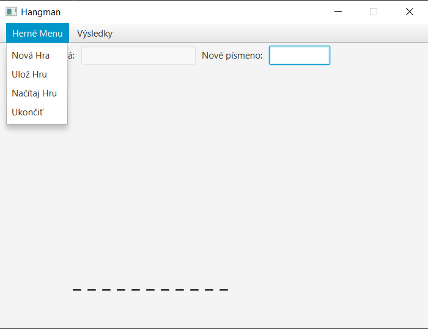
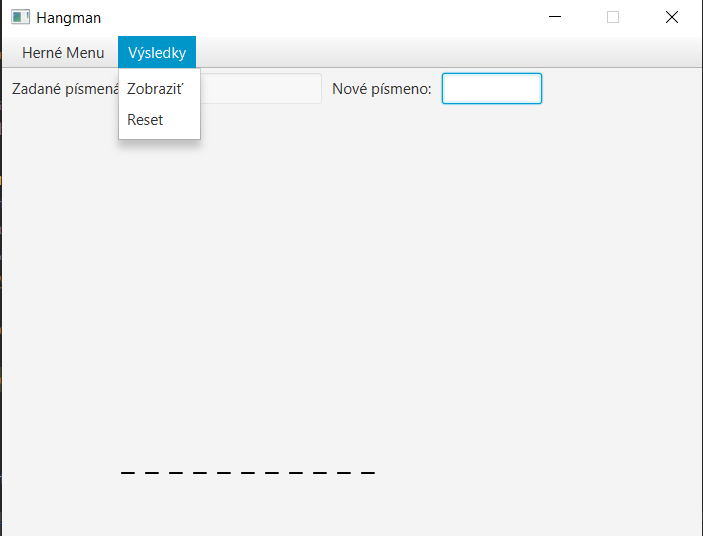
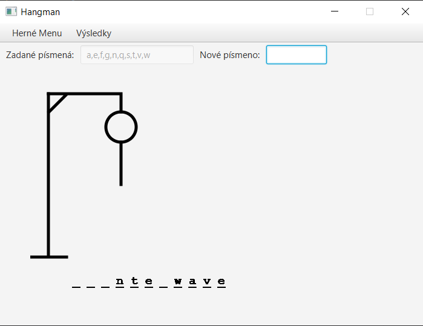
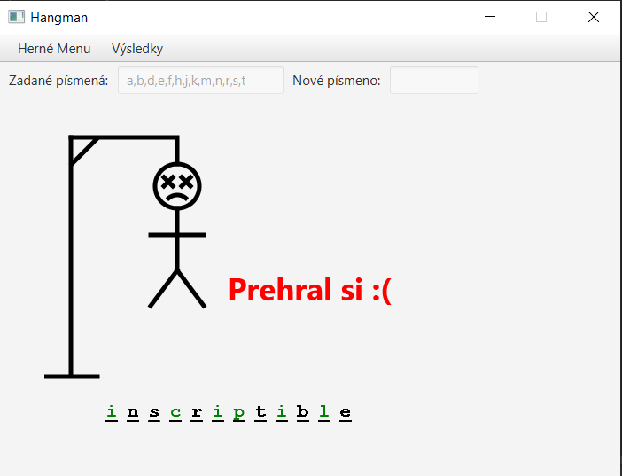
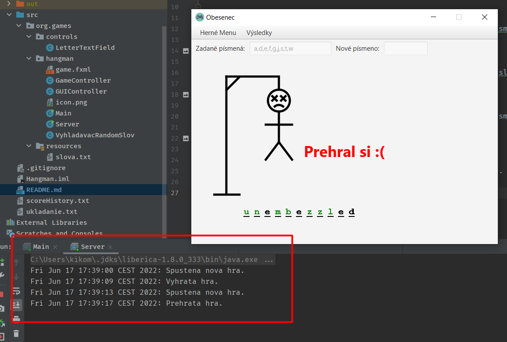

# Obesenec
Tento projekt je hra obesenec, ktora ponka herne menu s volbou novej hry, ulozenie hry, nacitanie hry, ak je ulozena a ukoncenie hry. 
##Herne menu:
</img>

##Menu rebricka:
Hra taktiez obsahuje moznost pozriet si rebricek najlepsich vysledkov, alebo tento rebricek resetovat.

</img>
___
##Cieľ hry:
Cieľom hry je uhádnuť slovo zadávaním jednotlivých písmen. Ak sme písmeno trafili, hádame ďalej, pokiaľ neuhádneme slovo, ak sme netrafili vykreslí sa jedna z častí obesenca.

</img>
###Vyhratá hra:
V prípade vyhratej hry sa nám zobrazí čas v sekundách, za ktorý sme slovo vyriešili.

</img>
###Prehratá hra:
V prípade prehratej hry sa nám zobrazí slovo a informácia o tom, že sme prehrali.

</img>
___
##Server (logovanie)
Hra komunikuje aj so serverom pre prípadné odkontrolovanie stavu hry. Do servera sa zapisujú správy aj presným časom kedy správy prišli

</img>

### !!! Pre správne fungovanie je potrebné prv spustiť program servera, až potom samotnú hru!!!
